# ☁️ CloudForge – AI-Powered Cloud Deployment Platform

CloudForge is a full-stack cloud deployment and infrastructure management platform inspired by modern DevOps tools such as **Vercel**, **Railway**, and **Render**. It enables users to manage cloud applications, deployments, and servers through a modern dashboard with AI-assisted deployment analysis, monitoring, reporting, and infrastructure visualization.

---

# 🚀 Features

## 🔐 Authentication
- User Registration
- User Login
- JWT Authentication
- Protected Dashboard

## 📦 Application Management
- Create Applications
- View Applications
- Update Applications
- Delete Applications

## 🖥️ Server Management
- Add Servers
- Update Server Details
- Delete Servers
- Live Server Health Monitoring
- CPU Usage Monitoring
- Memory Usage Monitoring
- Health Score Calculation

## 🚀 Deployment Management
- Create Deployments
- Edit Deployments
- Delete Deployments
- Deployment Status Tracking
- Deployment Pipeline Visualization

## 🤖 AI Modules

- AI Multi-Agent System
- AI Deployment Agent
- AI Error Diagnosis
- AI Knowledge Assistant
- AI Deployment Planner
- AI Deployment Simulator

## 📊 Dashboard

- Infrastructure Overview
- Cloud Deployment Pipeline
- Interactive Charts
- Resource Distribution
- System Statistics
- AI Infrastructure Insights

## 📈 Monitoring

- System Health Monitoring
- Activity Timeline
- Notifications
- Reports
- Cloud Architecture Visualization

---

# 🛠 Tech Stack

## Frontend

- Next.js
- React
- TypeScript
- Tailwind CSS

## Backend

- Next.js API Routes
- Prisma ORM

## Database

- PostgreSQL (Neon)

## Authentication

- JWT (JSON Web Token)

## ORM

- Prisma

## Charts

- Chart.js
- React ChartJS 2

## Reports

- jsPDF

---

# 📂 Project Structure

```
CloudForge
│
├── app
│   ├── api
│   ├── dashboard
│   ├── login
│   └── register
│
├── components
│
├── lib
│
├── prisma
│
├── public
│
└── README.md
```

---

# 🏗 System Architecture

```
                User
                  │
                  ▼
         Next.js Frontend
                  │
                  ▼
        JWT Authentication
                  │
                  ▼
        Next.js API Routes
                  │
        ┌─────────┴─────────┐
        ▼                   ▼
 Prisma ORM           AI Modules
        │
        ▼
 PostgreSQL (Neon)
```

---

# 📊 Dashboard Modules

- Dashboard
- Applications
- Deployments
- Servers
- AI Multi-Agent
- Deployment Agent
- Deployment Planner
- Deployment Simulator
- Error Diagnosis
- Knowledge Assistant
- Reports
- Notifications
- Activity Timeline
- System Status
- Cloud Architecture

---

# ⚙️ Installation

Clone the repository

```bash
git clone https://github.com/Pallavi-JS/cloudforge.git
```

Move into the project

```bash
cd CloudForge/apps/web
```

Install dependencies

```bash
npm install
```

Configure environment variables

Create a `.env` file:

```env
DATABASE_URL=YOUR_NEON_DATABASE_URL
JWT_SECRET=YOUR_SECRET_KEY
```

Run the project

```bash
npm run dev
```

Open

```
http://localhost:3000
```

---

# 📷 Project Screenshots

Add screenshots here after deployment.

- Login Page
- Dashboard
- Applications
- Servers
- Deployments
- AI Multi-Agent
- Deployment Planner
- Deployment Simulator
- Reports
- Cloud Architecture

---

# 🌟 Key Highlights

- Full Stack Cloud Deployment Platform
- JWT Authentication
- PostgreSQL Database
- Prisma ORM
- Interactive Dashboard
- Cloud Infrastructure Monitoring
- AI-Assisted Deployment Modules
- Deployment Analytics
- Professional UI Design
- REST API Architecture

---

# 🎯 Future Enhancements

- Docker Deployment
- Kubernetes Integration
- GitHub Repository Integration
- CI/CD Pipeline
- Multi-Cloud Deployment
- AI Log Analysis
- AI Cost Optimization
- Real-Time Monitoring
- Email Notifications
- Role-Based Access Control (RBAC)

---

# 👩‍💻 Developer

**Pallavi**

Final Year Engineering Student

AI & Full Stack Developer

---

# ⭐ If you like this project

Give it a ⭐ on GitHub.

## 📸 Screenshots

### 🏠 Landing Page
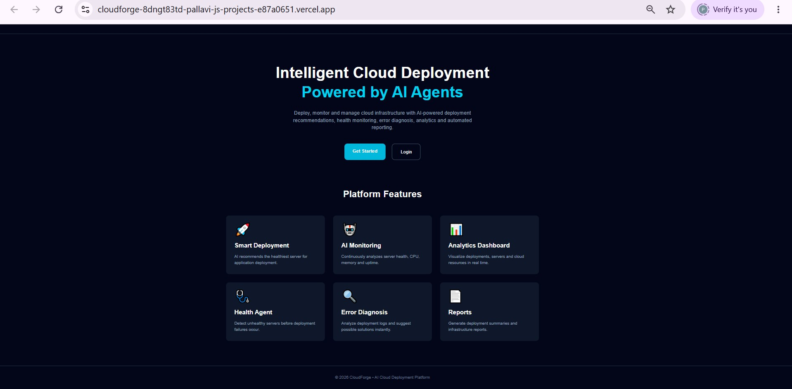

### 📊 Dashboard
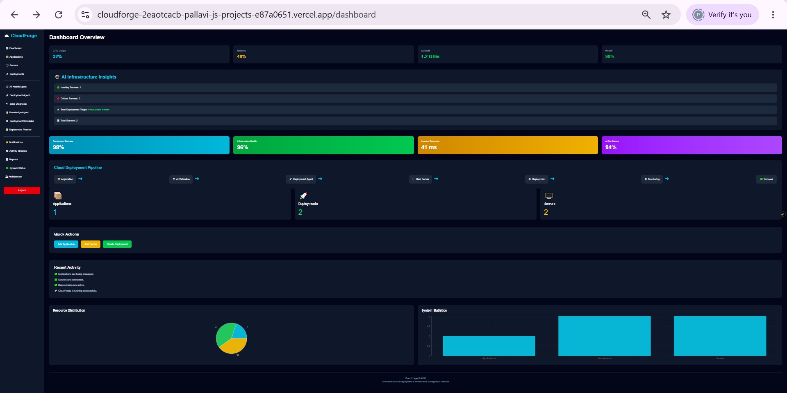

### 🚀 Applications
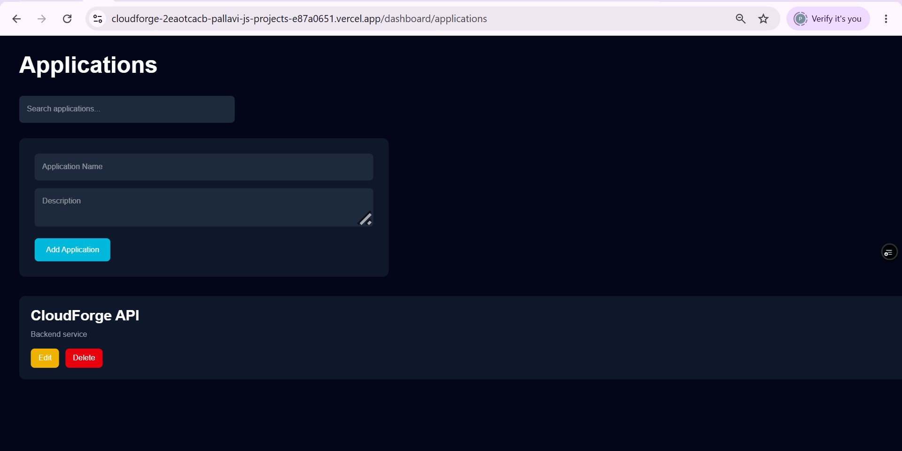

### 🖥️ Servers
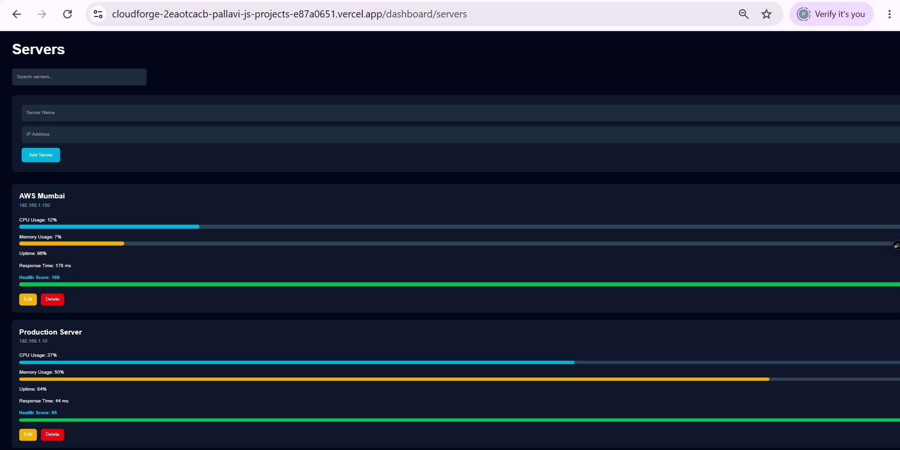

### 📦 Deployments
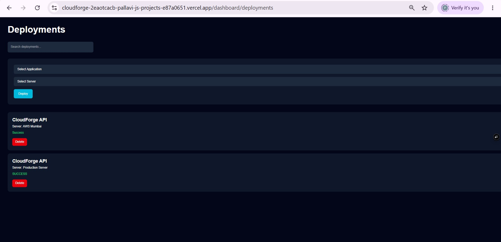

### 🤖 AI Health Agent
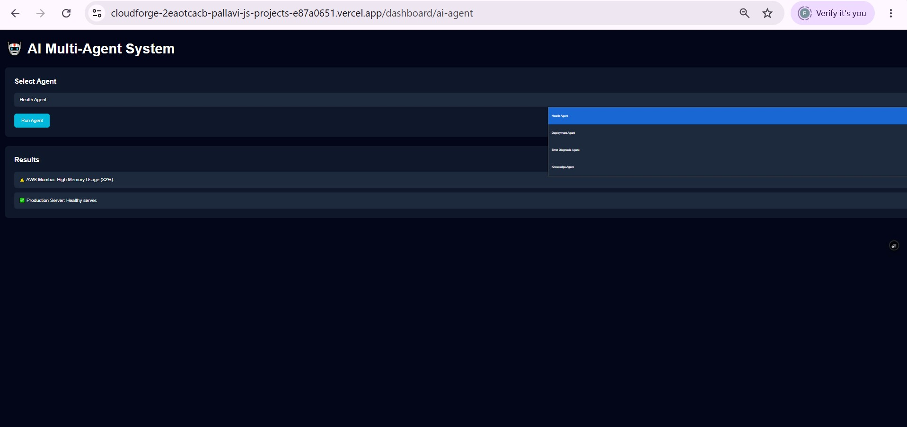

### 🔍 Error Diagnosis Agent
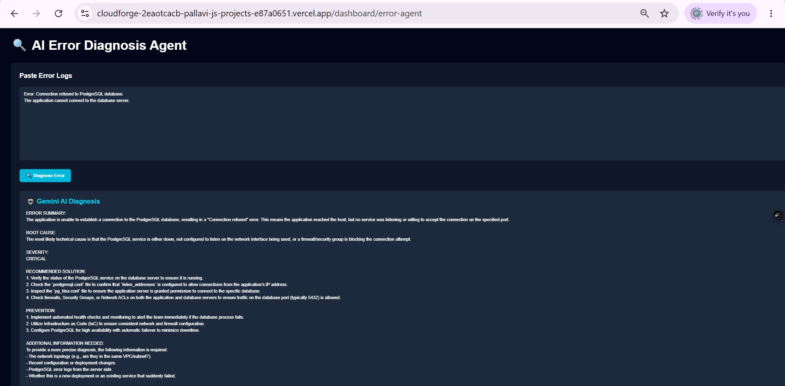

### 🚀 AI Deployment Agent
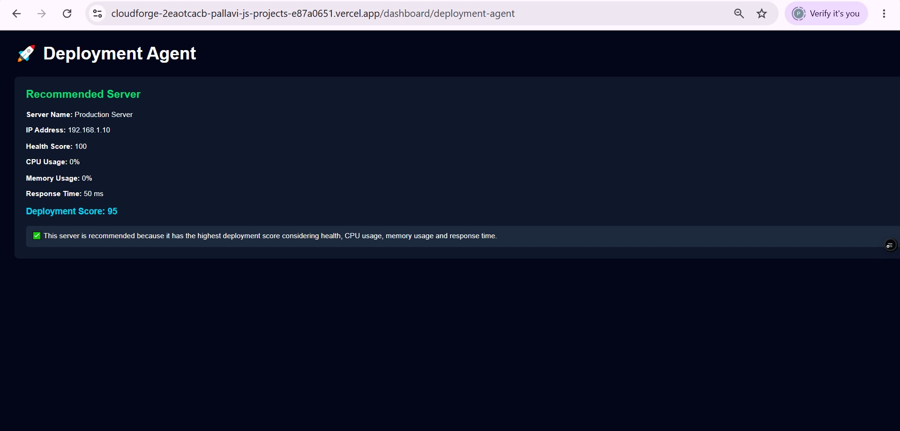

### 🧠 AI Deployment Planner
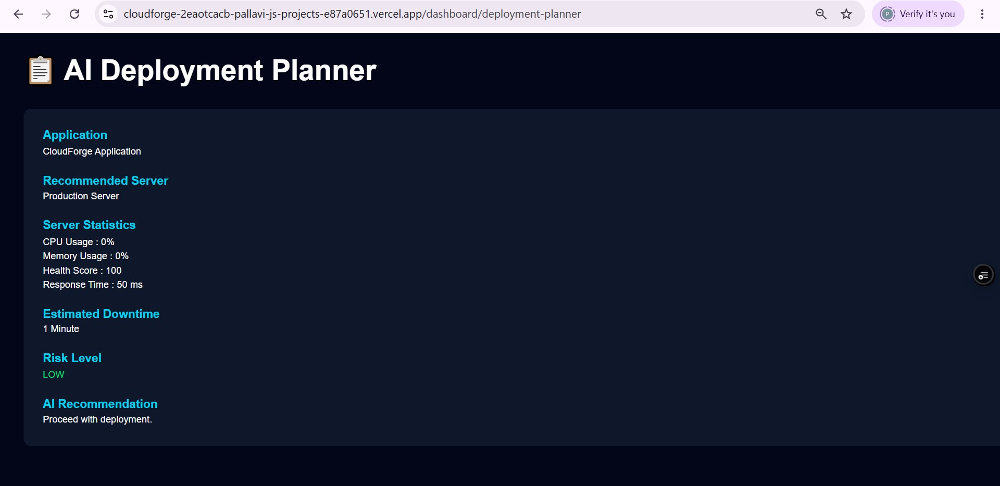

### 🧪 Deployment Simulator
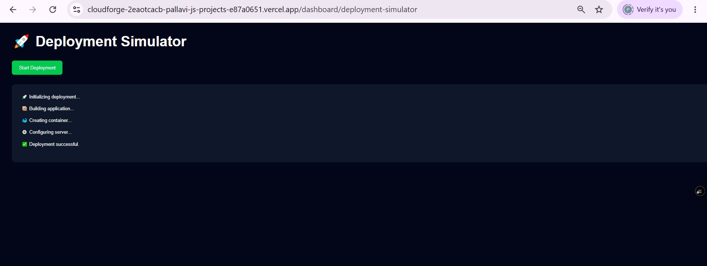

### 📚 Knowledge Agent
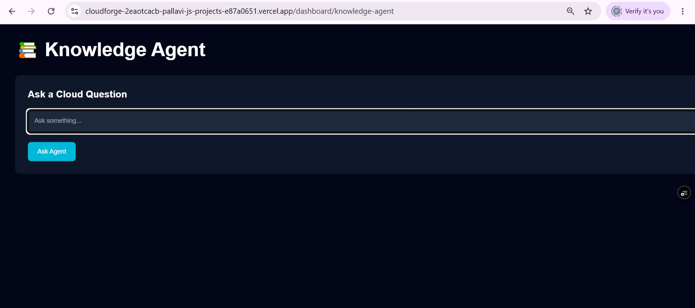